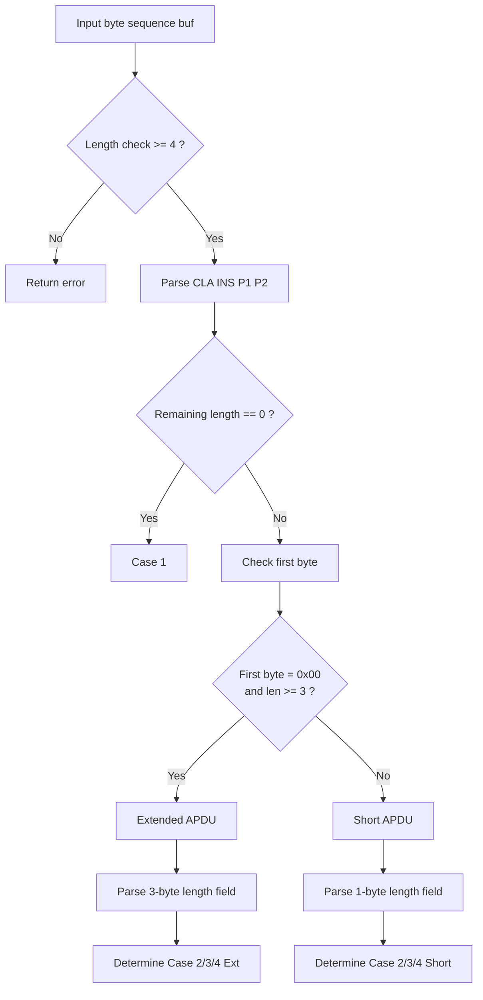
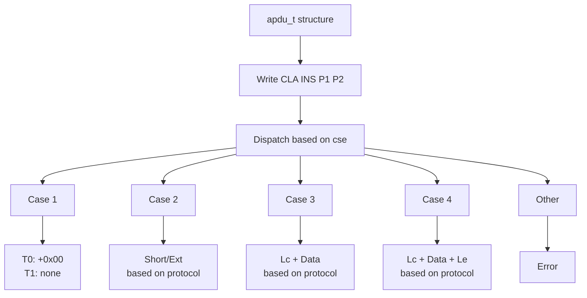

# libapdu Library Principles

## Introduction

libapdu is a lightweight C99 static library for encoding and decoding APDU (Application Protocol Data Unit). Extracted from the OpenSC project, it retains pure APDU parsing and assembly logic with no external dependencies—only the C99 standard library is required.

This document provides a detailed analysis of libapdu's core principles, including APDU protocol basics, data structure design, API function implementation details, encoding/decoding flows, and error handling mechanisms.

---

## Table of Contents

1. [APDU Basic Concepts](#1-apdu-basic-concepts)
   - [What is APDU](#11-what-is-apdu)
   - [Command APDU Structure](#12-command-apdu-c-apdu)
   - [Response APDU Structure](#13-response-apdu-r-apdu)
   - [Four APDU Cases](#14-four-apdu-cases)
2. [Data Structure Analysis](#2-data-structure-analysis)
   - [apdu_t Structure](#21-apdu_t-structure)
   - [Field Meanings](#22-field-meanings)
   - [Key Constants](#23-key-constants)
3. [API Function Details](#3-api-function-details)
   - [apdu_get_length()](#31-apdu_get_length)
   - [apdu_encode()](#32-apdu_encode)
   - [apdu_alloc_and_encode()](#33-apdu_alloc_and_encode)
   - [apdu_decode()](#34-apdu_decode)
   - [apdu_set_response()](#35-apdu_set_response)
4. [Encoding and Decoding Flows](#4-encoding-and-decoding-flows)
   - [Command APDU Decoding Flow](#41-command-apdu-decoding-flow)
   - [APDU Encoding Flow](#42-apdu-encoding-flow)
   - [Short APDU vs Extended APDU](#43-short-apdu-vs-extended-apdu)
5. [Error Handling](#5-error-handling)
   - [Error Code Definitions](#51-error-code-definitions)
   - [Error Return Scenarios by Function](#52-error-return-scenarios-by-function)
6. [Key Implementation Details](#6-key-implementation-details)
   - [Byte Order Handling](#61-byte-order-handling)
   - [Length Field Processing](#62-length-field-processing)
   - [T0 vs T1 Protocol Differences](#63-t0-vs-t1-protocol-differences)
   - [Boundary Condition Handling](#64-boundary-condition-handling)
7. [Memory Semantics and Caller Responsibilities](#7-memory-semantics-and-caller-responsibilities)
8. [Summary](#8-summary)

---

## 1. APDU Basic Concepts

### 1.1 What is APDU

**APDU (Application Protocol Data Unit)** is a standard protocol format for communication between smart cards and readers, defined in the ISO/IEC 7816-4 standard.

APDU defines data formats for two communication directions:
- **Command APDU (C-APDU)**: Command sent from the terminal to the smart card
- **Response APDU (R-APDU)**: Response returned from the smart card to the terminal

### 1.2 Command APDU (C-APDU)

The Command APDU is sent from the terminal to the smart card, with the following structure:

```
+------+-----+----+----+-----+----------+-----+
| CLA  | INS | P1 | P2 | Lc  | Data     | Le  |
+------+-----+----+----+-----+----------+-----+
| 1 byte| 1 byte|1 byte|1 byte|0-3 bytes|0-65535 bytes|0-3 bytes|
+------+-----+----+----+-----+----------+-----+
```

| Field | Description |
|-------|-------------|
| **CLA** | Class Byte, identifies the command class and characteristics |
| **INS** | Instruction Byte, identifies the specific instruction code |
| **P1, P2** | Parameter Bytes, provide additional parameters for the instruction |
| **Lc** | Command data length, number of bytes in the Data field |
| **Data** | Command data, the actual data content being transmitted |
| **Le** | Expected response length, indicates the maximum number of bytes expected to be returned |

### 1.3 Response APDU (R-APDU)

The Response APDU is returned from the smart card to the terminal, with the following structure:

```
+------------------+-------+-------+
| Data (optional)  | SW1   | SW2   |
+------------------+-------+-------+
| 0-N bytes        | 1 byte| 1 byte|
+------------------+-------+-------+
```

| Field | Description |
|-------|-------------|
| **Data** | Optional response data |
| **SW1, SW2** | Status Words, indicate command execution result |

Common status words:
- `0x9000`: Command executed successfully
- `0x6100`: More data available (use GET RESPONSE)
- `0x6A82`: File not found

### 1.4 Four APDU Cases

Based on the presence or absence of Lc and Le, Command APDUs are classified into four cases:

| Case | Lc | Le | Description |
|------|----|----|-------------|
| **Case 1** | No | No | No command data, no expected response |
| **Case 2** | No | Yes | No command data, has expected response |
| **Case 3** | Yes | No | Has command data, no expected response |
| **Case 4** | Yes | Yes | Has command data, has expected response |

Each case is further divided into **Short format** and **Extended format**:
- Short format: Lc/Le uses 1 byte
- Extended format: Lc/Le uses 2 or 3 bytes

---

## 2. Data Structure Analysis

### 2.1 `apdu_t` Structure

`apdu_t` is the core data structure of the library, used to represent an APDU:

```c
typedef struct apdu {
    int      cse;               /* APDU case (APDU_CASE_*) */
    u8       cla, ins, p1, p2;  /* CLA, INS, P1, P2 bytes */
    size_t   lc, le;            /* Lc and Le */
    const u8 *data;             /* Command data pointer */
    size_t   datalen;           /* Command data length */
    u8       *resp;             /* Response buffer */
    size_t   resplen;           /* In: buffer size; Out: actual length */
    u8       control;           /* Reader control flag (legacy) */
    unsigned sw1, sw2;          /* Status words */
    u8       mac[8];            /* MAC for secure messaging (legacy) */
    size_t   mac_len;           /* MAC length (legacy) */
    unsigned long flags;        /* APDU flags (legacy) */
    struct apdu *next;          /* Linked list for chaining (legacy) */
} apdu_t;
```

### 2.2 Field Meanings

| Field | Type | Purpose | Role in Encoding/Decoding |
|-------|------|---------|---------------------------|
| `cse` | `int` | APDU case type | **Automatically determined during decoding**; must be set before encoding |
| `cla`, `ins`, `p1`, `p2` | `u8` | Command header 4 bytes | Direct mapping during encoding/decoding |
| `lc` | `size_t` | Command data length | Parsed from Lc field during decoding; determines Lc field format during encoding |
| `le` | `size_t` | Expected response length | Parsed from Le field during decoding; determines Le field format during encoding |
| `data` | `const u8*` | Command data pointer | Points inside input buffer during decoding; reads source data during encoding |
| `datalen` | `size_t` | Data length | Set during decoding; effectively same as `lc` (redundant field) |
| `resp` | `u8*` | Response data buffer | Allocated by caller; written by `apdu_set_response()` |
| `resplen` | `size_t` | Buffer size/actual length | **Bidirectional semantics**: on input, represents buffer size; on output, represents actual data length |
| `control` | `u8` | Reader control flag | **Legacy field**, currently unused |
| `sw1`, `sw2` | `unsigned` | Status words | Set by `apdu_set_response()` |
| `mac[8]` | `u8[8]` | Secure messaging MAC | **Legacy field**, currently unused |
| `mac_len` | `size_t` | MAC length | **Legacy field**, currently unused |
| `flags` | `unsigned long` | APDU flags | **Legacy field**, currently unused |
| `next` | `struct apdu*` | Linked list pointer | **Legacy field**, used for command chaining |

### 2.3 Key Constants

**APDU Case Type Constants:**

```c
#define APDU_CASE_NONE       0x00   // Undetermined/invalid
#define APDU_CASE_1          0x01   // Case 1
#define APDU_CASE_2_SHORT    0x02   // Case 2 short format
#define APDU_CASE_3_SHORT    0x03   // Case 3 short format
#define APDU_CASE_4_SHORT    0x04   // Case 4 short format

#define APDU_SHORT_MASK      0x0f   // Short format mask
#define APDU_EXT             0x10   // Extended format flag

#define APDU_CASE_2_EXT      (APDU_CASE_2_SHORT | APDU_EXT)  // 0x12
#define APDU_CASE_3_EXT      (APDU_CASE_3_SHORT | APDU_EXT)  // 0x13
#define APDU_CASE_4_EXT      (APDU_CASE_4_SHORT | APDU_EXT)  // 0x14
```

**Buffer Size Limits:**

```c
#define APDU_MAX_SHORT_BUFFER_SIZE   261   /* Maximum short APDU length */
#define APDU_MAX_SHORT_DATA_SIZE     0xFF  /* Short APDU maximum data length: 255 */
#define APDU_MAX_SHORT_RESP_SIZE     (0xFF + 1)  /* Short APDU maximum response length: 256 */

#define APDU_MAX_EXT_BUFFER_SIZE     65538 /* Maximum extended APDU length */
#define APDU_MAX_EXT_DATA_SIZE       0xFFFF      /* Extended APDU maximum data length: 65535 */
#define APDU_MAX_EXT_RESP_SIZE       (0xFFFF + 1) /* Extended APDU maximum response length: 65536 */
```

**Protocol Type Constants:**

```c
#define APDU_PROTO_T0   0x00   // T=0 protocol (byte transmission)
#define APDU_PROTO_T1   0x01   // T=1 protocol (block transmission)
```

---

## 3. API Function Details

libapdu provides 5 core API functions:

### 3.1 `apdu_get_length()`

**Function Signature:**

```c
size_t apdu_get_length(const apdu_t *apdu, unsigned int proto);
```

**Description:**

Calculates the byte length of an encoded APDU. Used to pre-determine the buffer size needed for encoding.

**Parameters:**

| Parameter | Description |
|-----------|-------------|
| `apdu` | Pointer to APDU structure |
| `proto` | Protocol type (`APDU_PROTO_T0` or `APDU_PROTO_T1`) |

**Return Value:**

- Success: Returns the encoded byte length
- Failure: Returns `0` (indicates invalid input or unknown `cse` value)

**Length Calculation Rules:**

| Case | T0 Protocol | T1 Protocol |
|------|-------------|-------------|
| Case 1 | 5 bytes (+1 byte 0x00) | 4 bytes |
| Case 2 Short | 5 bytes | 5 bytes |
| Case 2 Ext | 5 bytes | 7 bytes |
| Case 3 Short | 5 + Lc bytes | 5 + Lc bytes |
| Case 3 Ext | 5 + Lc bytes | 7 + Lc bytes |
| Case 4 Short | 5 + Lc bytes | 6 + Lc bytes |
| Case 4 Ext | 5 + Lc bytes | 9 + Lc bytes |

**Usage Example:**

```c
apdu_t apdu;
apdu.cse = APDU_CASE_3_SHORT;
apdu.lc = 16;

size_t len = apdu_get_length(&apdu, APDU_PROTO_T1);
// len = 5 + 16 = 21
```

### 3.2 `apdu_encode()`

**Function Signature:**

```c
int apdu_encode(const apdu_t *apdu, unsigned int proto, u8 *out, size_t outlen);
```

**Description:**

Encodes an APDU structure into a byte sequence. The caller must pre-allocate the output buffer.

**Parameters:**

| Parameter | Description |
|-----------|-------------|
| `apdu` | APDU structure to encode |
| `proto` | Protocol type |
| `out` | Output buffer |
| `outlen` | Output buffer size |

**Return Value:**

| Return Value | Description |
|--------------|-------------|
| `APDU_SUCCESS` (0) | Encoding successful |
| `APDU_ERROR_INVALID_ARGUMENTS` (-1300) | Buffer too small or invalid parameters |

**Usage Example:**

```c
apdu_t apdu = {
    .cse = APDU_CASE_3_SHORT,
    .cla = 0x00,
    .ins = 0xA4,
    .p1 = 0x04,
    .p2 = 0x00,
    .lc = 2,
    .data = (const u8 *)"\x3F\x00"
};

size_t len = apdu_get_length(&apdu, APDU_PROTO_T1);
u8 *buf = malloc(len);

int ret = apdu_encode(&apdu, APDU_PROTO_T1, buf, len);
// buf = {0x00, 0xA4, 0x04, 0x00, 0x02, 0x3F, 0x00}

free(buf);
```

### 3.3 `apdu_alloc_and_encode()`

**Function Signature:**

```c
int apdu_alloc_and_encode(const apdu_t *apdu, u8 **buf, size_t *len, unsigned int proto);
```

**Description:**

Allocates memory and encodes an APDU. Automatically allocates the required buffer internally, simplifying the calling process.

**Parameters:**

| Parameter | Description |
|-----------|-------------|
| `apdu` | APDU structure to encode |
| `buf` | Output parameter, pointer to allocated buffer |
| `len` | Output parameter, encoded length |
| `proto` | Protocol type |

**Return Value:**

| Return Value | Description |
|--------------|-------------|
| `APDU_SUCCESS` | Encoding successful |
| `APDU_ERROR_INVALID_ARGUMENTS` | Parameter is NULL |
| `APDU_ERROR_INTERNAL` | Internal error (length calculation returned 0 or encoding failed) |
| `APDU_ERROR_OUT_OF_MEMORY` | Memory allocation failed |

**Memory Semantics:**

- The function allocates memory internally via `malloc()`
- **The caller must call `free()` when no longer needed**

**Usage Example:**

```c
apdu_t apdu = { /* ... */ };
u8 *buf = NULL;
size_t len = 0;

int ret = apdu_alloc_and_encode(&apdu, &buf, &len, APDU_PROTO_T1);
if (ret == APDU_SUCCESS) {
    // Use buf...
    free(buf);  // Remember to free!
}
```

### 3.4 `apdu_decode()`

**Function Signature:**

```c
int apdu_decode(const u8 *buf, size_t len, apdu_t *apdu);
```

**Description:**

Decodes a byte sequence into an APDU structure. Automatically determines the APDU Case type (short format/extended format).

**Parameters:**

| Parameter | Description |
|-----------|-------------|
| `buf` | Input byte sequence |
| `len` | Input length |
| `apdu` | Output APDU structure |

**Return Value:**

| Return Value | Description |
|--------------|-------------|
| `APDU_SUCCESS` | Decoding successful |
| `APDU_ERROR_INVALID_ARGUMENTS` | Parameter is NULL |
| `APDU_ERROR_INVALID_DATA` | Invalid data format (insufficient length, incomplete data, etc.) |

**Memory Semantics:**

- `apdu->data` points to a location inside the input buffer (**not a copy**)
- **The caller must keep the input buffer valid until the `apdu` is no longer in use**

**Usage Example:**

```c
u8 raw[] = {0x00, 0xA4, 0x04, 0x00, 0x02, 0x3F, 0x00};
apdu_t apdu;

int ret = apdu_decode(raw, sizeof(raw), &apdu);
if (ret == APDU_SUCCESS) {
    printf("Case: %d, LC: %zu\n", apdu.cse, apdu.lc);
    // apdu.data points to raw + 5, must keep raw valid
}
```

### 3.5 `apdu_set_response()`

**Function Signature:**

```c
int apdu_set_response(apdu_t *apdu, const u8 *buf, size_t len);
```

**Description:**

Sets response data and status words. Parses raw response data into the APDU structure.

**Parameters:**

| Parameter | Description |
|-----------|-------------|
| `apdu` | APDU structure to update |
| `buf` | Response data (last 2 bytes are SW1, SW2) |
| `len` | Response data length (must be >= 2) |

**Return Value:**

| Return Value | Description |
|--------------|-------------|
| `APDU_SUCCESS` | Setting successful |
| `APDU_ERROR_INTERNAL` | `len < 2` |

**Usage Example:**

```c
apdu_t apdu = { /* ... */ };
u8 response[] = {0x3F, 0x00, 0x90, 0x00};  // Data + SW1 + SW2

int ret = apdu_set_response(&apdu, response, sizeof(response));
// apdu.sw1 = 0x90, apdu.sw2 = 0x00
// apdu.resplen = 2 (data length)
```

---

## 4. Encoding and Decoding Flows

### 4.1 Command APDU Decoding Flow

The decoding process parses the byte sequence and automatically determines the APDU Case type:



**Key Decision Logic:**

1. **Length < 4**: Invalid data
2. **Length = 4**: Case 1
3. **First byte = 0x00 and len >= 3**: Extended APDU
4. **Otherwise**: Short APDU

### 4.2 APDU Encoding Flow

The encoding process determines output format based on the `cse` field:



### 4.3 Short APDU vs Extended APDU

| Feature | Short APDU | Extended APDU |
|---------|------------|---------------|
| **Lc bytes** | 1 byte | 3 bytes (0x00 + 2-byte length) |
| **Le bytes** | 1 byte | 2 or 3 bytes |
| **Lc maximum** | 255 | 65535 |
| **Le maximum** | 256 | 65536 |
| **Identification** | First byte not 0x00 (or length check) | First byte is 0x00 |

**Extended APDU Lc Encoding Format:**

```
+------+------+------+
| 0x00 | Lc_H | Lc_L |
+------+------+------+
  1 byte  high byte  low byte
```

---

## 5. Error Handling

### 5.1 Error Code Definitions

```c
#define APDU_SUCCESS                 0      // Success
#define APDU_ERROR_INVALID_ARGUMENTS -1300  // Invalid arguments
#define APDU_ERROR_INVALID_DATA      -1305  // Invalid data
#define APDU_ERROR_INTERNAL          -1400  // Internal error
#define APDU_ERROR_OUT_OF_MEMORY     -1404  // Out of memory
```

**Error Code Origin:** These error codes are inherited from the OpenSC project, maintaining compatibility with the original project.

### 5.2 Error Return Scenarios by Function

| Function | Error Code | Trigger Condition |
|----------|------------|-------------------|
| `apdu_get_length` | `0` | Unknown `cse` value |
| `apdu_encode` | `INVALID_ARGUMENTS` | `out == NULL` |
| `apdu_encode` | `INVALID_ARGUMENTS` | Buffer too small |
| `apdu_encode` | `INVALID_ARGUMENTS` | T0 protocol with `lc > 255` (Case 3 Ext) |
| `apdu_alloc_and_encode` | `INVALID_ARGUMENTS` | Any parameter is NULL |
| `apdu_alloc_and_encode` | `INTERNAL` | `apdu_get_length()` returned 0 |
| `apdu_alloc_and_encode` | `OUT_OF_MEMORY` | `malloc()` failed |
| `apdu_alloc_and_encode` | `INTERNAL` | `apdu_encode()` failed |
| `apdu_decode` | `INVALID_ARGUMENTS` | `buf` or `apdu` is NULL |
| `apdu_decode` | `INVALID_DATA` | `len < 4` |
| `apdu_decode` | `INVALID_DATA` | Data length doesn't match Lc |
| `apdu_decode` | `INVALID_DATA` | Insufficient extended APDU data |
| `apdu_decode` | `INVALID_DATA` | Remaining data after parsing |
| `apdu_set_response` | `INTERNAL` | `len < 2` |

---

## 6. Key Implementation Details

### 6.1 Byte Order Handling

The library uses **Big-Endian** for multi-byte length fields, conforming to the ISO 7816 standard:

**During Encoding (high byte first):**

```c
*p++ = (u8)(apdu->le >> 8);  // Write high byte first
*p   = (u8)apdu->le;          // Then low byte
```

**During Decoding (high byte first):**

```c
apdu->le  = (size_t)(*p++) << 8;  // High byte shifted left 8 bits
apdu->le += *p++;                  // Add low byte
```

### 6.2 Length Field Processing

**Short Format:**

- Lc: 1 byte, range 1-255
- Le: 1 byte, range 0-256 (`0x00` means 256)

**Extended Format:**

- Lc: 3 bytes (`0x00` + 2-byte length), range 1-65535
- Le: 2 bytes (when following Lc) or 3 bytes (when no Lc), range 0-65536

**Special Meaning of Le = 0:**

In the APDU protocol, an Le field of 0 indicates expecting maximum length response:

```c
// Short APDU: Le = 0 means expecting 256-byte response
if (apdu->le == 0)
    apdu->le = 0xFF + 1;  // i.e., 256

// Extended APDU: Le = 0 means expecting 65536-byte response
if (apdu->le == 0)
    apdu->le = 0xFFFF + 1;  // i.e., 65536
```

### 6.3 T0 vs T1 Protocol Differences

T=0 and T=1 are two transmission protocols for smart card communication, with different requirements for APDU encoding:

| Scenario | T=0 Protocol | T=1 Protocol |
|----------|--------------|--------------|
| **Case 1** | Requires appending 0x00 byte | No extra byte |
| **Case 2 Ext** | Simplified to 1-byte Le | Uses 3 bytes (0x00 + Le) |
| **Case 3 Ext** | Not supported (Lc > 255 requires ENVELOPE) | Supports 3-byte Lc |
| **Case 4 Short** | Does not encode Le (use procedure byte to get response) | Encodes 1-byte Le |
| **Case 4 Ext** | Simplified to Case 3 format | Full encoding 3-byte Lc + 2-byte Le |

**T=0 Protocol Special Handling:**

```c
case APDU_CASE_1:
    if (proto == APDU_PROTO_T0)
        *p = (u8)0x00;  // T0 needs extra 0x00 byte
    break;
```

### 6.4 Boundary Condition Handling

The library performs strict boundary checks on input data:

**Minimum Length Check:**

```c
if (len < 4)
    return APDU_ERROR_INVALID_DATA;
```

**Data Length Consistency Check:**

```c
if (len < apdu->lc)
    return APDU_ERROR_INVALID_DATA;
```

**Completeness Check (no remaining data after parsing):**

```c
if (len)  // Still remaining data after parsing
    return APDU_ERROR_INVALID_DATA;
```

---

## 7. Memory Semantics and Caller Responsibilities

libapdu's API design follows clear memory management rules:

| Function | Memory Allocation | Caller Responsibility |
|----------|-------------------|----------------------|
| `apdu_decode()` | No allocation | Keep input buffer valid until `apdu` is no longer in use |
| `apdu_encode()` | No allocation | Pre-allocate sufficiently large output buffer |
| `apdu_alloc_and_encode()` | Internal `malloc()` | Call `free()` to release returned buffer after use |
| `apdu_get_length()` | No allocation | None |
| `apdu_set_response()` | No allocation | Keep response buffer valid |

**Key Notes:**

1. **`apdu_decode()` does not copy data**: `apdu->data` directly points to a location inside the input buffer. Modifying or freeing the input buffer after decoding will cause `apdu->data` to become a dangling pointer.

2. **`apdu_alloc_and_encode()` requires manual deallocation**: This function allocates memory using `malloc()`, and the caller is responsible for freeing it.

3. **Bidirectional semantics of `resplen`**: Before setting the response, `resplen` indicates the buffer size; after setting the response, it indicates the actual returned data length.

---

## 8. Summary

libapdu is a streamlined, efficient APDU encoding/decoding library with the following core characteristics:

### Design Features

1. **Pure C99 Implementation**: No external dependencies, only standard library required, easy to integrate
2. **Complete Case Support**: Supports all 4 APDU Cases defined by ISO 7816, including short and extended formats
3. **Protocol Adaptation**: Distinguishes between T=0 and T=1 protocol handling differences
4. **Clear Memory Semantics**: Clearly distinguishes between caller-allocated and library-allocated scenarios

### API Design

| API | Function | Typical Use Case |
|-----|----------|------------------|
| `apdu_get_length()` | Calculate encoded length | Pre-allocate buffer |
| `apdu_encode()` | Encode to caller's buffer | Known buffer size |
| `apdu_alloc_and_encode()` | Allocate and encode | Simplify calling process |
| `apdu_decode()` | Decode to structure | Parse received command |
| `apdu_set_response()` | Set response data | Handle response |

### Legacy Compatibility

The library retains some compatibility fields from OpenSC (`mac`, `control`, `next`, etc.), but these fields are not actually used in the current API and can be safely ignored.

---

## References

- ISO/IEC 7816-4: Organization, security and commands for interchange
- [OpenSC Project](https://github.com/OpenSC/OpenSC)